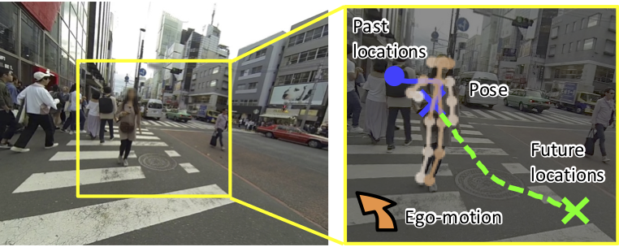
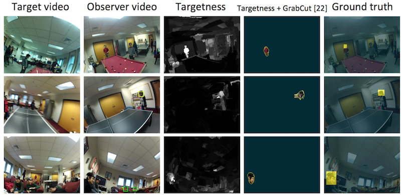
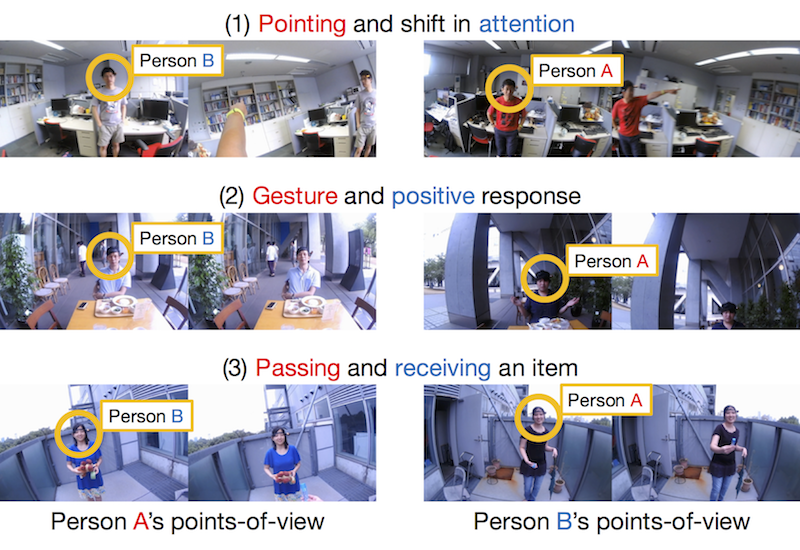
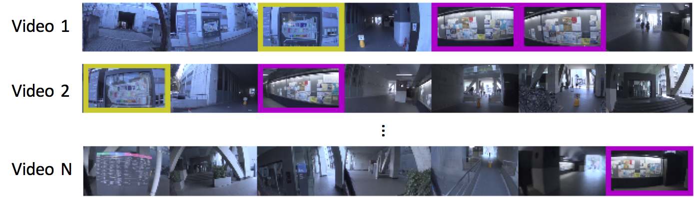
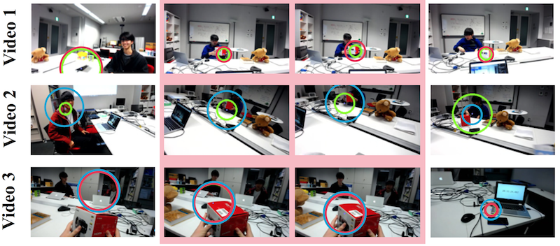

First-person vision is an emerging topic in the area of computer vision which makes use of wearable cameras for solving various vision problems. We envision a future where people have such wearable cameras as daily necessities, like a smartphone that most of us own today, and have been developing techniques and applications that can be enabled by collectively using multiple wearable cameras.

## Why First-Person Vision?
Wearable cameras mounted on the head of people can record their visual experience, such as what they see and interact, in the form of first-person points-of-view video. From human sensing perspective, first-person videos involve several appealing properties that cannot be achieved just by using conventional surveillance cameras.

- **Sensing attention**: Since wearable cameras are supposed to be mounted on the head of people, first-person videos often contain what the recorders paid attention. Recent advancement of camera technologies further offers wearable eye-trackers that gives us access to specific objects or points that the recorders look at.
- **Sensing head motion**: Another interesting property enabled by mounting a camera on the head is that, camera motion is induced by head motion of the recorders. This property makes it easier to analyze various head gestures (such as nodding) observed during daily interactions.
- **Sensing hands**: When recorders are involved in a certain individual task (like cooking, eating, and using laptops), first-person videos often capture how they use their hands.
- **Sensing people**: When recorders are conversing with others, the conversation partners, not only their visual appearances but also their motion induced by gestures, are observed clearly in first-person videos.

## Our Projects

### Future Person Localization (CVPR'18)

We present a new task that predicts future locations of people observed in first-person videos. Consider a first-person video stream continuously recorded by a wearable camera. Given a short clip of a person that is extracted from the complete stream, we aim to predict his location in future frames. To facilitate this future person localization ability, we make the following three key observations: a) First-person videos typically involve significant ego-motion which greatly affects the location of the target person in future frames; b) Scale of the target person act as a salient cue to estimate a perspective effect in first-person videos; c) First-person videos often capture people up-close, making it easier to leverage target poses (e.g. where they look) for predicting their future locations. We incorporate these three observations into a prediction framework with a multi-stream convolution-deconvolution architecture. Experimental results reveal our method to be effective on our new dataset as well as on a public social interaction dataset.

- Takuma Yagi, Karttikeya Mangalam, Ryo Yonetani, Yoichi Sato: “Future Person Localization in First-Person Videos”, IEEE Conference on Computer Vision and Pattern Recognition (CVPR, spotlight presentation), 2018 [[Paper](https://openaccess.thecvf.com/content_cvpr_2018/html/Yagi_Future_Person_Localization_CVPR_2018_paper.html)] [[Code](https://github.com/takumayagi/fpl)]

### Person Identification (CVPR'15, TPAMI'18)

We developed a self-search technique tailored to first-person videos. The key observation of our work is that the egocentric head motion of a target person (ie, the self) is observed both in the POV video of the target and observer. The motion correlation between the target person’s video and the observer’s video can then be used to identify instances of the self uniquely. We incorporate this feature into the proposed approach that computes the motion correlation over densely-sampled trajectories to search for a target in observer videos. Our approach significantly improves self-search performance over several well-known face detectors and recognizers. Furthermore, we show how our approach can enable several practical applications such as privacy filtering, target video retrieval, and social group clustering.

- Ryo Yonetani, Kris Kitani, Yoichi Sato: “Ego-Surfing: Person Localization in First-Person Videos Using Ego-Motion Signatures”, IEEE Transactions on Pattern Analysis and Machine Intelligence (TPAMI), Vol.40, Issue 11, pp.2749-2761, 2018 [[Paper](https://arxiv.org/abs/1606.04637)] [[Dataset](https://www.dropbox.com/s/onx530l5doqbrsb/yks_cvpr2015.zip?dl=0)]
- Ryo Yonetani, Kris Kitani, Yoichi Sato: “Ego-Surfing First-Person Videos”, IEEE Conference on Computer Vision and Pattern Recognition (CVPR), 2015 [[Paper](https://www.cv-foundation.org/openaccess/content_cvpr_2015/html/Yonetani_Ego-Surfing_First-Person_Videos_2015_CVPR_paper.html)]

### Action Recognition (CVPR'16)

We aim to understand the dynamics of social interactions between two people by recognizing their actions and reactions using a head-mounted camera. To recognize micro-level actions and reactions, such as slight shifts in attention, subtle nodding, or small hand actions, where only subtle body motion is apparent, we propose to use paired egocentric videos recorded by two interacting people. We show that the first-person and second-person points-of-view features of two people, enabled by paired egocentric videos, are complementary and essential for reliably recognizing micro-actions and reactions. We also build a new dataset of dyadic (two-persons) interactions that comprises more than 1000 pairs of egocentric videos to enable systematic evaluations on the task of micro-action and reaction recognition.

- Ryo Yonetani, Kris Kitani, Yoichi Sato: “Recognizing Micro-Actions and Reactions from Paired Egocentric Videos”, IEEE Conference on Computer Vision and Pattern Recognition (CVPR), 2016 [[Paper](https://www.cv-foundation.org/openaccess/content_cvpr_2016/html/Yonetani_Recognizing_Micro-Actions_and_CVPR_2016_paper.html)] [[Dataset](https://www.dropbox.com/s/ihy5qdoliktfozx/yks_cvpr2016_release.zip?dl=0)]

### Landmark Discovery (ECCV'16)

Visual motifs are images of visual experiences that are significant and shared across many people, such as an image of an informative sign viewed by many people and that of a familiar social situation such as when interacting with a clerk at a store. The goal of this study is to discover visual motifs from a collection of first-person videos recorded by a wearable camera. To achieve this goal, we develop a commonality clustering method that leverages three important aspects: inter-video similarity, intra-video sparseness, and people’s visual attention. The problem is posed as normalized spectral clustering, and is solved efficiently using a weighted covariance matrix. Experimental results suggest the effectiveness of our method over several state-of-the-art methods in terms of both accuracy and efficiency of visual motif discovery.

- Ryo Yonetani, Kris Kitani, Yoichi Sato: “Visual Motif Discovery via First-Person Vision”, European Conference on Computer Vision (ECCV), 2016 [[Paper](https://link.springer.com/chapter/10.1007/978-3-319-46475-6_12)] [[Dataset](https://www.dropbox.com/s/jt8d0ru2l2atvm0/yks_eccv2016_release.zip?dl=0)]

### Joint Attention Detection (CVPRW'16, ICCVW'17)

The goal of this work is to discover objects of joint attention, i.e., objects being viewed by multiple people using head-mounted cameras and eye trackers. Such objects of joint attention are expected to act as an important cue for understanding social interactions in everyday scenes. To this end, we develop a commonality-clustering method tailored to first-person videos combined with points-of-gaze sources. The proposed method uses multiscale spatiotemporal tubes around points of gaze as a candidate of objects, making it possible to deal with various sizes of objects observed in the first-person videos. We also introduce a new dataset of multiple pairs of first-person videos and points-of-gaze data. Our experimental results show that our approach can outperform several state-of-the-art commonality-clustering methods.

- Yifei Huang, Minjie Cai, Hiroshi Kera, Ryo Yonetani, Keita Higuchi, Yoichi Sato: “Temporal Localization and Spatial Segmentation of Joint Attention in Multiple First-Person Video”, International Workshop on Egocentric Perception, Interaction, and Computing (EPIC), 2017 [[Paper](http://openaccess.thecvf.com/content_ICCV_2017_workshops/w34/html/attention_hyfiis.u-tokyo.ac.jp_cai-mjiis.u-tokyo.ac.jp_keraiis.u-tokyo.ac.jp_ICCV_2017_paper.html)] 
- Hiroshi Kera, Ryo Yonetani, Keita Higuchi, Yoichi Sato: “Discovering Objects of Joint Attention via First-Person Sensing”, IEEE CVPR Workshop on Egocentric (First-Person) Vision (EGOV), 2016 [[Paper](https://www.cv-foundation.org/openaccess/content_cvpr_2016_workshops/w13/html/Kera_Discovering_Objects_of_CVPR_2016_paper.html)]