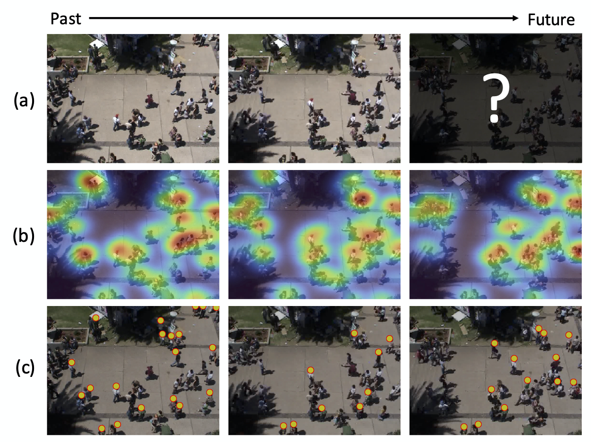
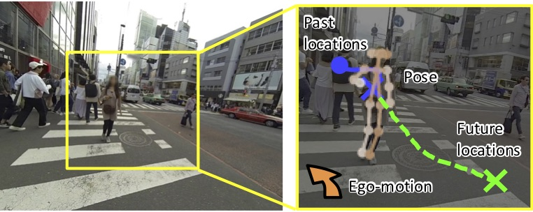

Activity forecasting refers to the problems of predicting future behaviors of people observed in videos. We are particularly interested in trajectory forecasting that is aimed at predicting whhere pedestrians (or essentially moving agents such as bikes and cars) will move from their past trajectories. Trajectory forecasting techniques could be useful for controlling mobile robots or autonomous vehicles while safely avoiding collisions with surrounding people, and will ultimately play a crucial role in the near future where people and robots live and work together.

## Our Projects
### Crowd Density Forecasting (RA-L'20)

Forecasting human activities observed in videos is a long-standing challenge in computer vision and robotics and is also beneficial for various real-world applications such as mobile robot navigation and drone landing. In this work, we present a new forecasting task called crowd density forecasting . Given a video of a crowd captured by a surveillance camera, our goal is to predict how the density of the crowd will change in unseen future frames. To address this task, we developed the patch-based density forecasting networks (PDFNs), which directly forecasts crowd density maps of future frames instead of trajectories of each moving person in the crowd. The PDFNs represent crowd density maps based on spatially or spatiotemporally overlapping patches and learn a simple density dynamics of fewer people in each patch. Doing so allows us to efficiently deal with diverse and complex crowd density dynamics observed when input videos involve a variable number of crowds moving independently. Experimental results with several public datasets of surveillance videos demonstrate the effectiveness of our approaches compared with state-of-the-art forecasting methods.

- Hiroaki Minoura, Ryo Yonetani, Mai Nishimura, and Yoshitaka Ushiku, "Crowd Density Forecasting by Modeling Patch-based Dynamics", IEEE Robotics and Automation Letters, 2020 [[Paper](https://ieeexplore.ieee.org/document/9286551)] [[Blog](https://medium.com/sinicx/crowd-density-forecasting-by-modeling-patch-based-dynamics-ieee-ra-l-4053a276c2f4)]

### Future Person Localization (CVPR'18)

We present a new task that predicts future locations of people observed in first-person videos. Consider a first-person video stream continuously recorded by a wearable camera. Given a short clip of a person that is extracted from the complete stream, we aim to predict his location in future frames. To facilitate this future person localization ability, we make the following three key observations: a) First-person videos typically involve significant ego-motion which greatly affects the location of the target person in future frames; b) Scale of the target person act as a salient cue to estimate a perspective effect in first-person videos; c) First-person videos often capture people up-close, making it easier to leverage target poses (e.g. where they look) for predicting their future locations. We incorporate these three observations into a prediction framework with a multi-stream convolution-deconvolution architecture. Experimental results reveal our method to be effective on our new dataset as well as on a public social interaction dataset.

- Takuma Yagi, Karttikeya Mangalam, Ryo Yonetani, Yoichi Sato: “Future Person Localization in First-Person Videos”, IEEE Conference on Computer Vision and Pattern Recognition (CVPR, spotlight presentation), 2018 [[Paper](https://openaccess.thecvf.com/content_cvpr_2018/html/Yagi_Future_Person_Localization_CVPR_2018_paper.html)] [[Code](https://github.com/takumayagi/fpl)]
